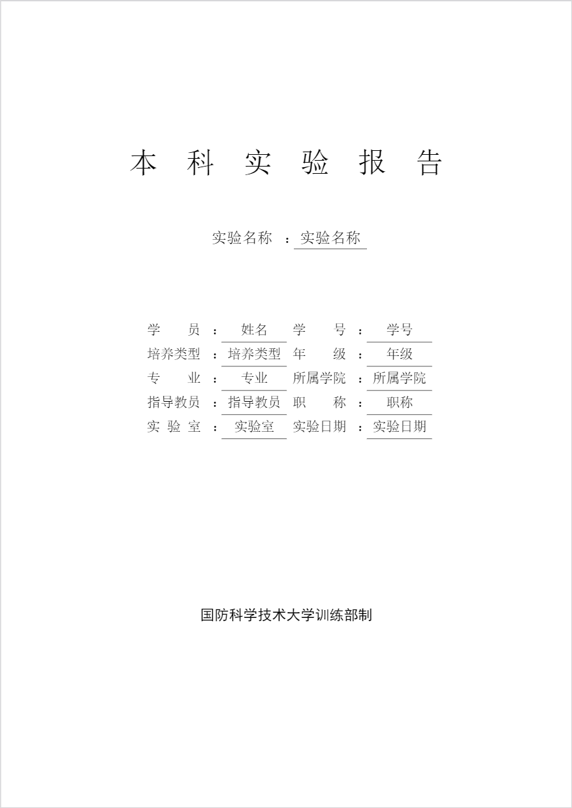
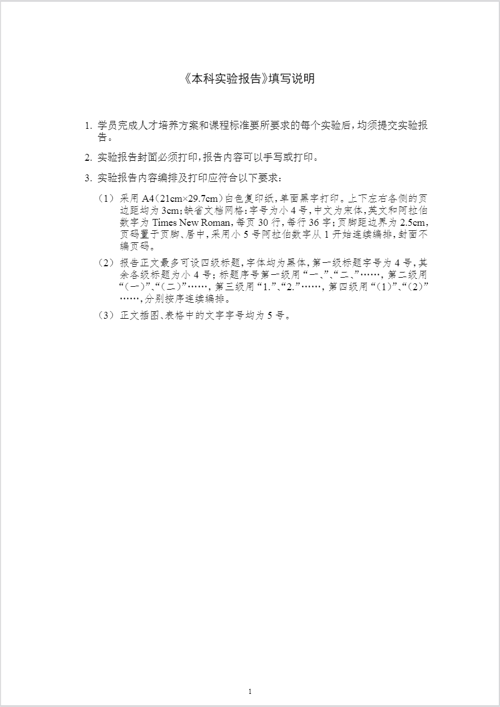
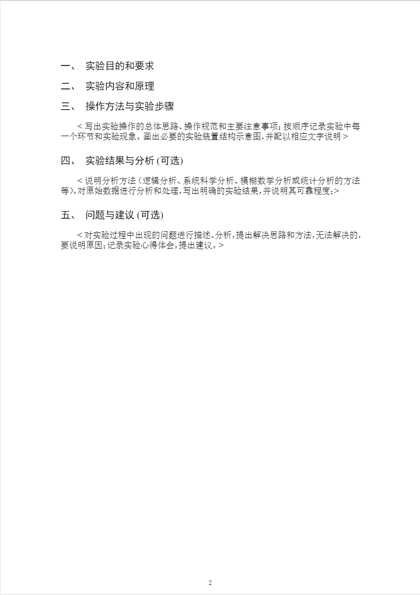

# Experiment Report Template
 

Experiment report template of NUDT undergraduate/国防科技大学本科实验报告(模板)

## Usage

[本科实验报告(模版).tex](https://github.com/pisceskkk/ExperimentReportTemplate/blob/main/本科实验报告(模版).tex) 为模板主体。

1. 在第27行至37行的[实验信息](https://github.com/pisceskkk/ExperimentReportTemplate/blob/200295e8b7d4da9abc258b0e3430428d123065fe/%E6%9C%AC%E7%A7%91%E5%AE%9E%E9%AA%8C%E6%8A%A5%E5%91%8A(%E6%A8%A1%E7%89%88).tex#L25)中修改添加封面信息。

   i.e. `\newcommand{\theTitle}{实验名称}` 修改为 `\newcommand{\theTitle}{基于LDA的多分类实验}`

2. 在[排版](https://github.com/pisceskkk/ExperimentReportTemplate/blob/200295e8b7d4da9abc258b0e3430428d123065fe/%E6%9C%AC%E7%A7%91%E5%AE%9E%E9%AA%8C%E6%8A%A5%E5%91%8A(%E6%A8%A1%E7%89%88).tex#L40)中自定义排版效果。

3. 在[正文](https://github.com/pisceskkk/ExperimentReportTemplate/blob/200295e8b7d4da9abc258b0e3430428d123065fe/%E6%9C%AC%E7%A7%91%E5%AE%9E%E9%AA%8C%E6%8A%A5%E5%91%8A(%E6%A8%A1%E7%89%88).tex#L167)中书写实验报告内容。

4. 注意：请勿随意修改[封面](https://github.com/pisceskkk/ExperimentReportTemplate/blob/200295e8b7d4da9abc258b0e3430428d123065fe/%E6%9C%AC%E7%A7%91%E5%AE%9E%E9%AA%8C%E6%8A%A5%E5%91%8A(%E6%A8%A1%E7%89%88).tex#L99)和[填写说明](https://github.com/pisceskkk/ExperimentReportTemplate/blob/200295e8b7d4da9abc258b0e3430428d123065fe/%E6%9C%AC%E7%A7%91%E5%AE%9E%E9%AA%8C%E6%8A%A5%E5%91%8A(%E6%A8%A1%E7%89%88).tex#L142)！

[fonts](https://github.com/pisceskkk/ExperimentReportTemplate/tree/main/fonts) 文件夹中包含该模板的必要字体。若编译后出现文字缺失或乱码，请尝试安装文件夹中的字体并重新编译。

## Screenshots

## License

[MIT](https://github.com/pisceskkk/ExperimentReportTemplate/blob/main/LICENSE)
